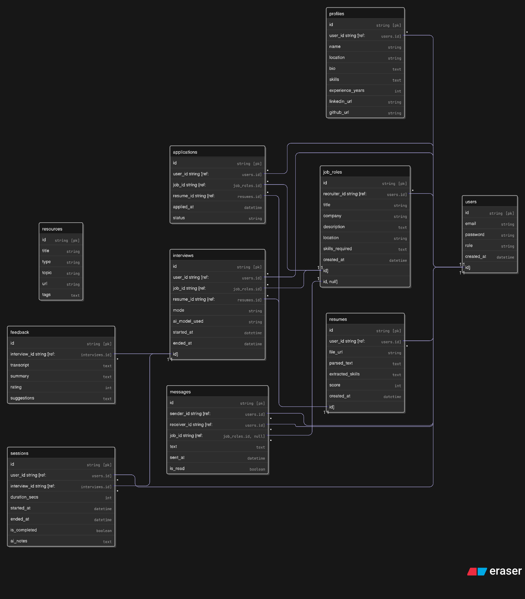

# 🧭 Project Name (Placeholder): `IntervueAI` – AI-Powered Career Prep Assistant

---

## 💡 Goal

Build a **full-stack AI SaaS** web app where a job seeker can:

* Upload resume → get feedback & score
* Receive tailored job recommendations
* Get role/resume-based **mock interviews** with **voice or text**
* Receive **interview feedback**, transcripts, resources

---

## ⚙️ Tech Stack

| Layer       | Tech Used                                           |
| ----------- | --------------------------------------------------- |
| Frontend    | Next.js (App Router) + TailwindCSS + TypeScript     |
| Backend     | Next.js API routes or Express.js (your choice)      |
| Database    | PostgreSQL + Prisma                                 |
| Auth        | Auth.js / Clerk / Firebase Auth                     |
| File Upload | UploadThing or AWS S3                               |
| AI Services | OpenAI GPT-4o / Whisper (for voice-to-text)         |
| Voice Input | Web Speech API / Whisper API                        |
| Deployment  | Vercel (Frontend/API) + Railway/Render (DB/Backend) |

---

## 📋 Key Features

### ✅ MVP Features (Phase 1)

1. **User Auth (Google/Email)**
2. **Resume Upload & Analysis**

   * Parse content (PDF/DOCX)
   * Use OpenAI to evaluate resume
   * Score & suggest improvements
3. **Job Role Input / JD Paste**

   * Generate mock interview questions using resume + role/JD
4. **Mock Interview (Text-Based)**

   * LLM asks questions → user answers → AI scores & gives feedback
5. **Voice Input (Optional Toggle)**

   * Use Web Speech API (or Whisper) for voice answers
6. **Interview Transcript & Feedback**

   * Store Q\&A, generate score, soft skills analysis
7. **Resource Suggestions**

   * Based on weak areas → curated learning links / text
8. **Basic Dashboard (User History)**

---

### 🌱 Phase 2 (Post MVP)

* Job Recommender (scrape/fetch from APIs based on resume)
* Resume Builder/Editor (inline GPT-suggested edits)
* Leaderboard (top resumes / prep scores)
* AI Coach Chatbot (persistent assistant for prep)
* Book real interviews with mentors (stretch)

---

## 🗺️ 4-Week Roadmap

---

### 🚀 Week 1: Setup & Resume Feedback System

#### Goals:

* Project structure
* User auth
* Resume upload + GPT analysis

#### Tasks:

* [ ] Setup Next.js project with Tailwind + Auth.js or Clerk
* [ ] Create simple dashboard layout (Sidebar + Main)
* [ ] Implement file upload (UploadThing / S3)
* [ ] Parse resume file content
* [ ] Create OpenAI prompt for resume scoring & improvements
* [ ] Show results (score, strengths, 3 suggestions)

#### Milestone:

✅ **User can upload resume → see AI-based score + feedback**

---

### 🧠 Week 2: Job Role → AI Interview Generator (Text-Based)

#### Goals:

* Generate mock interview from JD or role
* Accept text answers and score them

#### Tasks:

* [ ] Job role form: Enter role or paste JD
* [ ] GPT prompt: Generate questions based on JD + resume
* [ ] Mock interview screen: Show Q → take user text input
* [ ] Store questions & answers in DB
* [ ] GPT feedback prompt: Review answers, give per-question score + summary
* [ ] Display transcript with feedback

#### Milestone:

✅ **User gets a tailored interview → answers → receives AI feedback**

---

### 🎤 Week 3: Voice Input + Transcript + Interview History

#### Goals:

* Add voice input mode
* Store and view past interviews

#### Tasks:

* [ ] Add Web Speech API for voice answers (with fallback to text)
* [ ] Transcribe voice → text (or use Whisper API)
* [ ] Store Q\&A, scores in DB
* [ ] Create dashboard to list past interviews with:

  * Role
  * Score
  * Timestamp
  * View full transcript

#### Milestone:

✅ **User can take voice-based interview → view full transcript & feedback**

---

### 🎯 Week 4: Polish, Resources & Deploy

#### Goals:

* Add resource links
* Improve UX
* Deploy frontend + backend

#### Tasks:

* [ ] Based on feedback, show resources (like "You should review OS/DBMS")
* [ ] Add loading skeletons, error states
* [ ] Host backend (Railway or Render)
* [ ] Host frontend (Vercel)
* [ ] Setup environment vars & secure API keys

#### Milestone:

✅ **Live app users can fully use AI career prep from resume to mock interview**

---

## 🧱 DB Schema (MVP)

### User

```ts
id | email | name | authProvider | createdAt
```

### Resume

```ts
id | userId | fileUrl | parsedText | score | feedback | createdAt
```

### InterviewSession

```ts
id | userId | role | jobDescription | createdAt | totalScore
```

### InterviewQA

```ts
id | sessionId | question | answer | score | feedback | createdAt
```

---

## 🧪 Sample Prompts

### Resume Scoring Prompt

> “Analyze the following resume and rate it from 1–10 for Software Engineering roles. Provide 3 detailed improvement suggestions, and highlight any missing key skills. Resume:\n\n{{parsed\_text}}”

---

### Interview Generation Prompt

> “Given the role {{role}} and this resume:\n{{resume\_text}}, generate 5 interview questions: 3 technical, 1 behavioral, 1 resume-specific.”

---

### Interview Feedback Prompt

> “Here are a candidate’s answers to an interview. Evaluate each for correctness, confidence, clarity, and completeness. Give scores (1–5) and improvement tips.\n\n{{qa\_transcript}}”

---


